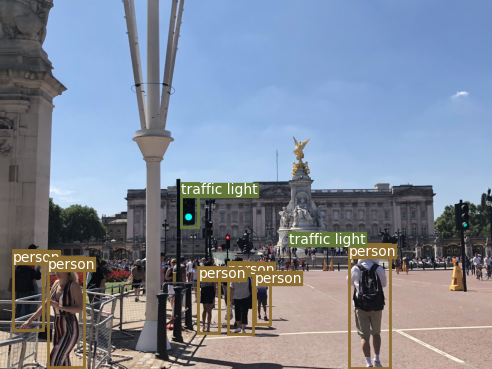
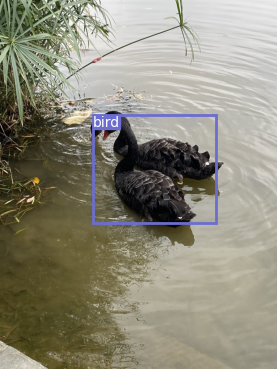

# Final project of Wang Shuai
Based on a Pytorch implementation of YOLOv3, prompt three improvement for YOLOv3.  
If any problems met, please e-mail to sc17s2w@leeds.ac.uk with no hesitation.


## Prepare work
##### Clone and install requirements
    $ git clone https://github.com/Dan944/project

##### Set the environment
    $ pip install -r requirements.txt
    
##### Strongly recommand setting CUDA and CUDNN for GPU training


    
## Running on COCO

##### Result show
<p align="center"></p>
<p align="center"></p>
<p align="center"></p>

##### Download pretrained weights
    $ cd weights/
    $ bash download_weights.sh
##### Detect the image in samples
    $ python3 detect.py
##### Download COCO dataset
    $ cd data/
    $ bash get_coco_dataset.sh
##### Evaluates the model on COCO test.
    $ python test.py --weights_path weights/yolov3.weights
##### For further training
    $ python train.py --model_def config/yolov3.cfg --data_conig config/coco.data
    
    

## Run on PASCAL VOC (or other dataset)

#### Prepare  
1.Download the data.    
2.Save the images in `project/data/custom/images`, save the labels in `project/data/custom/labels`.    
3.Save the paths of train data in `project/data/custom/train.txt`, save the paths of test data in `project/data/custom/valid.txt`.  
A sample file `project/data/custom/transform_voc_data.py` could be referenced for step 2,3  
(If select VOC, step 1-3 is enough)
4.run the code `config/create_custom_model.sh <num-classes>`    
5.Change class names to `data/custom/classes.names`  

#### Train
    $ python train.py --model config/yolov3-custom.cfg --data config/custom.data
Add `--pretrained_weights weights/darknet53.conv.74` to train using a backend pretrained on ImageNet.

#### Test
    $ python test.py --model config/yolov3-custom.cfg --data config/custom.data --weight_path <your trained weight>


## Credit


```
@article{yolov3,
  title={YOLOv3: An Incremental Improvement},
  author={Redmon, Joseph and Farhadi, Ali},
  journal = {arXiv},
  year={2018}
}
```
