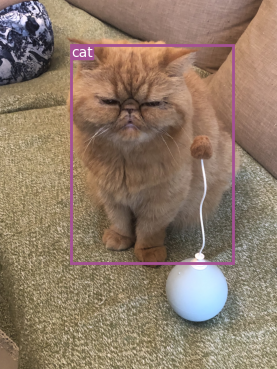

# Final project of Wang Shuai
Based on a Pytorch implementation of YOLOv3, prompt three improvement for YOLOv3


## Prepare work
##### Clone and install requirements
    $ git clone https://github.com/Dan944/project

##### Set the environment
    $ pip install -r requirements.txt
    
##### Strongly recommand setting CUDA and CUDNN for GPU training


    
## Running on COCO

##### Result show
<p align="center"></p>
<p align="center"></p>
<p align="center"></p>

##### Download pretrained weights
    $ cd weights/
    $ bash download_weights.sh
##### Detect the image in samples
    $ python3 detect.py
##### Download COCO dataset
    $ cd data/
    $ bash get_coco_dataset.sh
##### Evaluates the model on COCO test.
    $ python test.py --weights_path weights/yolov3.weights
##### For further training
    $ python train.py --model_def config/yolov3.cfg --data_conig config/coco.data
    
    

## Train on Custom Dataset

#### Custom model
Run the commands below to create a custom model definition, replacing `<num-classes>` with the number of classes in your dataset.

```
$ cd config/                                # Navigate to config dir
$ bash create_custom_model.sh <num-classes> # Will create custom model 'yolov3-custom.cfg'
```

#### Classes
Add class names to `data/custom/classes.names`. This file should have one row per class name.

#### Image Folder
Move the images of your dataset to `data/custom/images/`.

#### Annotation Folder
Move your annotations to `data/custom/labels/`. The dataloader expects that the annotation file corresponding to the image `data/custom/images/train.jpg` has the path `data/custom/labels/train.txt`. Each row in the annotation file should define one bounding box, using the syntax `label_idx x_center y_center width height`. The coordinates should be scaled `[0, 1]`, and the `label_idx` should be zero-indexed and correspond to the row number of the class name in `data/custom/classes.names`.

#### Define Train and Validation Sets
In `data/custom/train.txt` and `data/custom/valid.txt`, add paths to images that will be used as train and validation data respectively.

#### Train
To train on the custom dataset run:

```
$ python train.py --model_def config/yolov3-custom.cfg --data_config config/custom.data
```

Add `--pretrained_weights weights/darknet53.conv.74` to train using a backend pretrained on ImageNet.


## Credit

### YOLOv3: An Incremental Improvement
_Joseph Redmon, Ali Farhadi_ <br>

**Abstract** <br>
We present some updates to YOLO! We made a bunch
of little design changes to make it better. We also trained
this new network that’s pretty swell. It’s a little bigger than
last time but more accurate. It’s still fast though, don’t
worry. At 320 × 320 YOLOv3 runs in 22 ms at 28.2 mAP,
as accurate as SSD but three times faster. When we look
at the old .5 IOU mAP detection metric YOLOv3 is quite
good. It achieves 57.9 AP50 in 51 ms on a Titan X, compared
to 57.5 AP50 in 198 ms by RetinaNet, similar performance
but 3.8× faster. As always, all the code is online at
https://pjreddie.com/yolo/.

[[Paper]](https://pjreddie.com/media/files/papers/YOLOv3.pdf) [[Project Webpage]](https://pjreddie.com/darknet/yolo/) [[Authors' Implementation]](https://github.com/pjreddie/darknet)

```
@article{yolov3,
  title={YOLOv3: An Incremental Improvement},
  author={Redmon, Joseph and Farhadi, Ali},
  journal = {arXiv},
  year={2018}
}
```
